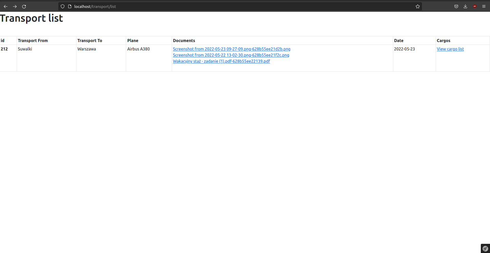

# Recruitment task in php using Symfony framework

It consists of the following:

* PHP: 8.1-fpm
* Nginx: stable-alpine
* MariaDB: 10.7
* phpMyAdmin: latest

Main page is at [localhost:80]()

All transport and cargo can be seen at [localhost/transport/list]() or at [localhost:8080]() in phpMyAdmin.
Documents uploaded in form are stored in storage/documents/

## Installation

* Clone this repository on your local computer
* Run the `docker-compose up -d`.
* Inside container with php run `composer install` and `php bin/console doctrine:migrations:migrate`
* Visit localhost:80 for app
* Visit localhost:8080 for phpMyAdmin

```shell
git clone https://github.com/Pawebf1/Recruitment-task.git
cd Recruitment-task
docker-compose up -d
docker-compose exec recruitment-task-php bash -c "composer install; php bin/console doctrine:migrations:migrate"
```

## Screenshots

### Main page


### Adding more cargo


### Success submit


### View at /transport/list



### View in phpMyAdmin


### Email


### Validation of files and date

